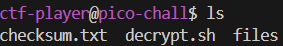
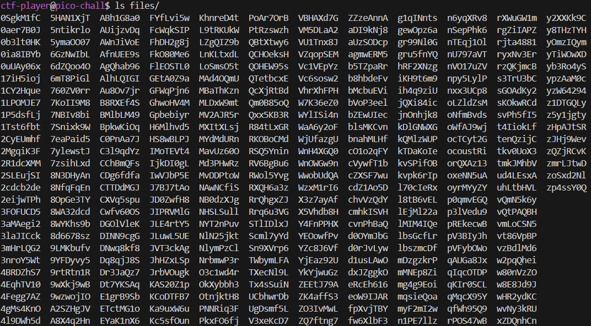

# Verify

## Tools used
- ssh
- sha256sum: checks SHA256 checksums

## Challenge
Connect to the remote server using SSH: `ssh -p 55316 ctf-player@rhea.picoctf.net`
Are you sure you want to continue connecting (yes/no/[fingerprint])? `yes`
Put then the given password.

Once connected, let's display all the files using `ls`:

The `checksum.txt` file probably contains the SHA256 hash, while `decrypt.sh` the script to decrypt the correct file.

Inside the `checksum.txt` there is (using `cat checksum.txt`):
55b983afdd9d10718f1db3983459efc5cc3f5a66841e2651041e25dec3efd46a

Now, let's see which files are present inside the `files/` Directory (using `ls files/`):

Since there are many files, we need to compute the SHA256 checksum on each file and find the one that has the same checksum contained in `checksum.txt`.
`sha256sum files/ | grep 55b983afdd9d10718f1db3983459efc5cc3f5a66841e2651041e25dec3efd46a`

We find that the match is found for file `files/2cdcb2de`, so we use the `decrypt.sh` script to decrypt that file:
`./decrypt.sh files/2cdcb2de`

picoCTF{trust_but_verify_2cdcb2de}

