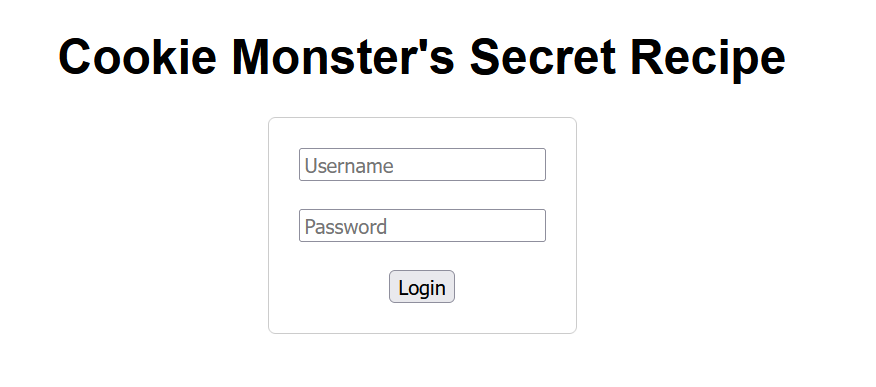
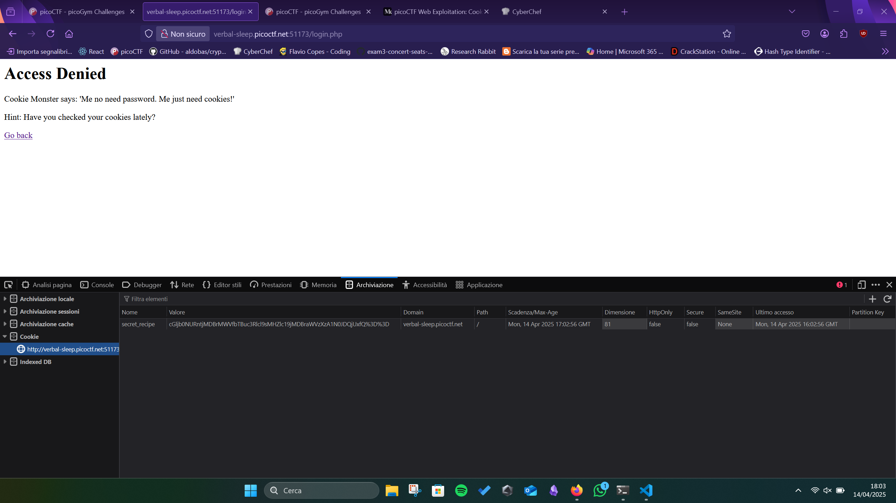

# Cookie Monster Secret Recipe
The first page displays this:

Inserting some data in the login form, the page generates a cookie:

We decode it as a URL, then decode from the Base64 format to get the flag.
Cookie: `cGljb0NURntjMDBrMWVfbTBuc3Rlcl9sMHZlc19jMDBraWVzXzA1N0JDQjUxfQ%3D%3D`
URL Decoded cookie: `cGljb0NURntjMDBrMWVfbTBuc3Rlcl9sMHZlc19jMDBraWVzXzA1N0JDQjUxfQ==`
Base 64 of the URL decoded cookie: `picoCTF{c00k1e_m0nster_l0ves_c00kies_057BCB51}`

