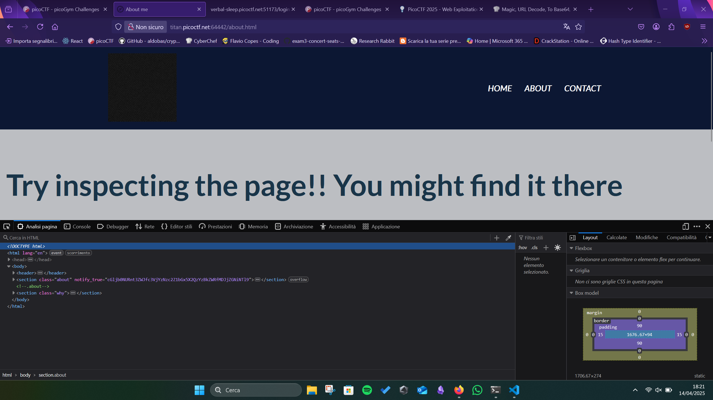

# WebDecode
This challenge looks like the Cookie Monster one. We just need to navigate the page with the inspection tool. After clicking the `About` button, with the inspection we can find:

Here, the `cGljb0NURnt3ZWJfc3VjYzNzc2Z1bGx5X2QzYzBkZWRfMDJjZGNiNTl9` looks like Base 64 encoded: the decoding gives us the flag:
`picoCTF{web_succ3ssfully_d3c0ded_02cdcb59}`